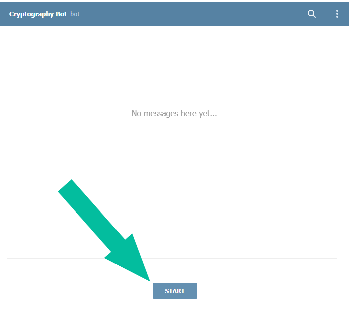
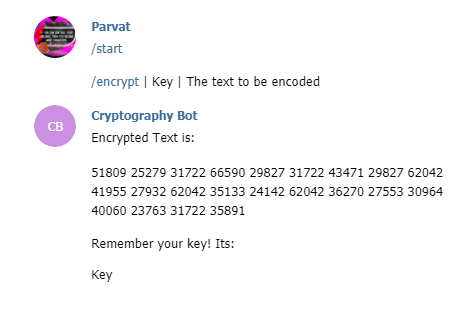

<h1 align='center'> Cryptography Bot </h1>
<h6 align='right'>From <a href="https://sprin-g-reen.github.io/home">sprin-g-reen</a> for <a href='https://telegram.org/'>telegram</a></h6>

  <h3>Usage:</h3>
  
  - Go To: <a href='https://telegram.me/simple_cryptography_bot'>@simple_cryptography_bot</a>
  - Use Some Valid <a href='#cmds'>Commands</a>
  - Get Your Encoded Or Decoded Text
  - Dont Forget To Join [SPRINGREEN](https://telegram.me/venilabots) in telegram

<h3 id='cmds'>Commands:</h3>

  - `/start`
    - Starts the bot
    - </img>
  - `/encrypt` or `/en`
    - Encodes the given text with the given key.
    - Usage Format:
      - `/en | Your Key | The Text To Be Encoded` or `/encrypt | Your Key | The text To Be Encoded`
    - </img>
  - `/decrypt` or `/de`
    - Decodes an encoded text with the given key.
    - Usage Format:
      - `/de | Your Key | The Text to be Decoded` or `/decrypt | Your Key | The Text to be Decoded`
  - `/crypto`

